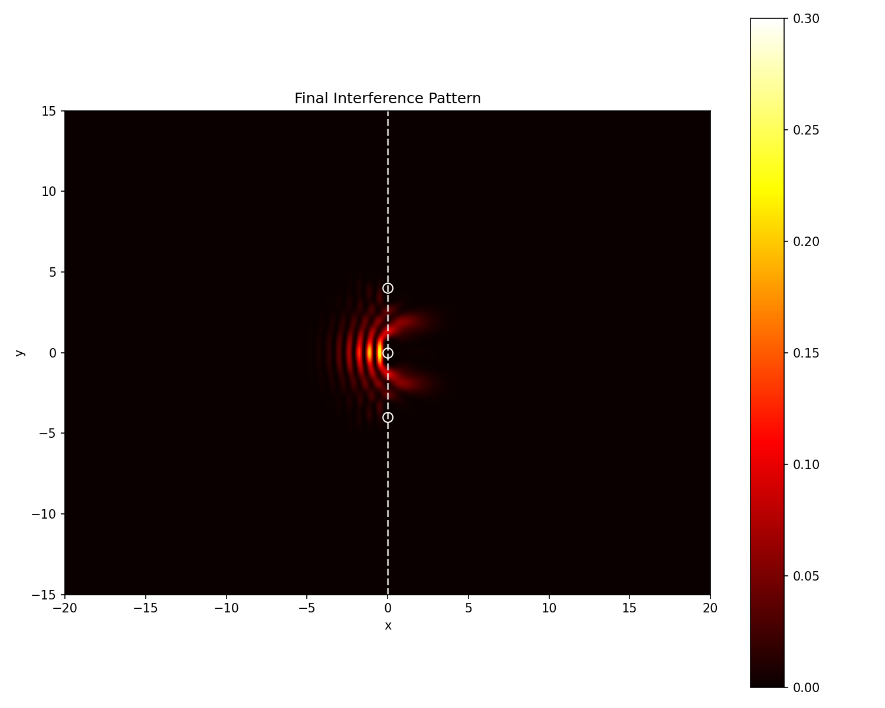
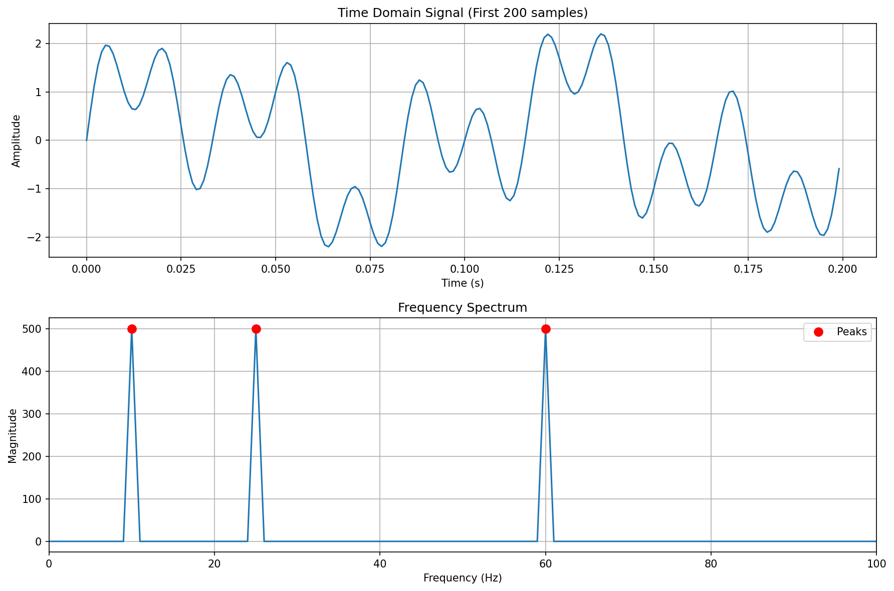
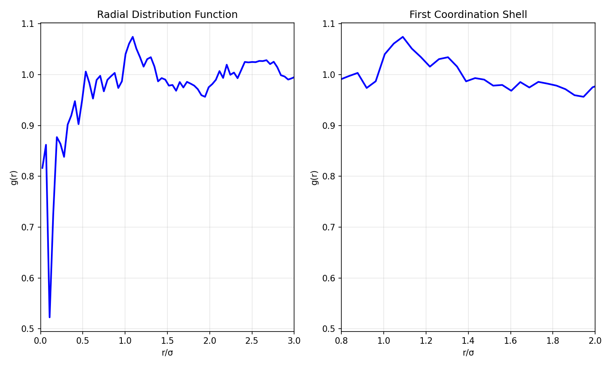

# Math-Physics-ML Plugin

GPU-accelerated MCP plugin for computational mathematics, quantum physics simulations, molecular dynamics, and neural network training.

## Features

This plugin provides access to 4 MCP servers:

| Server | Description | Tools |
|--------|-------------|-------|
| **math-mcp** | Symbolic algebra & GPU numerical computing | 12 tools |
| **quantum-mcp** | Wave mechanics & Schrodinger simulations | 12 tools |
| **molecular-mcp** | Classical molecular dynamics | 13 tools |
| **neural-mcp** | Neural network training | 15 tools |

## Installation

### Prerequisites

1. Install the math-mcp project:
```bash
cd ~/work/math-mcp
uv sync --all-extras
```

2. Install the plugin:
```bash
# From Claude Code
claude plugins install ./math-physics-ml

# Or add to your plugins directory
cp -r math-physics-ml ~/.claude/plugins/
```

## Usage

### Slash Commands

| Command | Description |
|---------|-------------|
| `/math-physics-ml:solve` | Solve mathematical equations |
| `/math-physics-ml:derive` | Compute symbolic derivatives |
| `/math-physics-ml:integrate` | Compute symbolic integrals |
| `/math-physics-ml:fft` | Fast Fourier Transform |
| `/math-physics-ml:quantum-sim` | Run quantum simulations |
| `/math-physics-ml:md-sim` | Run molecular dynamics |
| `/math-physics-ml:train` | Train neural networks |
| `/math-physics-ml:info` | Server capabilities overview |

### Skills (AI-Invocable)

The plugin includes skills that Claude can invoke automatically:

- **math** - Symbolic math and numerical computing
- **quantum** - Quantum mechanics simulations
- **molecular** - Molecular dynamics simulations
- **neural** - Neural network training

### Direct MCP Tool Access

All MCP tools are available with the prefix `mcp__<server>__<tool>`:

```
mcp__math-mcp__symbolic_solve
mcp__quantum-mcp__create_gaussian_wavepacket
mcp__molecular-mcp__run_md
mcp__neural-mcp__train_model
```

## Quick Start

**You know the physics. You know the math. You just don't want to learn SymPy, NumPy, or PyTorch APIs.**

Describe what you want in plain English—the plugin handles the implementation:

---

### See It In Action

#### Quantum Interference
> *"Create a video of a Gaussian wave packet passing through a triple slit"*



#### Signal Analysis
> *"Analyze a signal with hidden frequencies at 10Hz, 25Hz, and 60Hz"*



#### Liquid Structure
> *"Simulate 500 argon atoms equilibrating to a liquid and compute the radial distribution function"*



---

### Relativity & Spacetime
```
Compute the Lorentz transformation for a frame moving at 0.8c

Derive the Schwarzschild metric and find the event horizon radius for a 10 solar mass black hole

Calculate gravitational time dilation at Earth's surface vs GPS satellite altitude

Solve the geodesic equation for a particle falling radially into a black hole

Show length contraction and time dilation for a muon traveling at 0.99c
```

### Quantum Mechanics
```
Create a video of a Gaussian wave packet passing through a triple slit

Simulate quantum tunneling through a rectangular barrier - what's the transmission probability?

Show a particle in an infinite square well transitioning between energy eigenstates

Model the Stern-Gerlach experiment with spin-1/2 particles

Compute the hydrogen atom wavefunctions for n=1,2,3 and visualize the orbitals
```

### Statistical Mechanics & MD
```
Simulate 500 argon atoms equilibrating to a liquid at reduced temperature 0.8

Model a Lennard-Jones fluid undergoing a liquid-gas phase transition

Compute the velocity autocorrelation function and extract the diffusion coefficient

Run a canonical ensemble simulation and verify the Maxwell-Boltzmann distribution

Calculate the heat capacity from energy fluctuations in an NVT simulation
```

### Language Models & Embeddings
```
Train a small transformer on the tiny Shakespeare dataset and generate samples

Create word embeddings from a corpus using skip-gram with negative sampling

Build a character-level autoregressive model and train it on Python code

Train a micro GPT (4 layers, 4 heads) on arithmetic expressions

Fine-tune embeddings to cluster similar sentences together
```

### Neural Networks & Deep Learning
```
Train ResNet-18 on CIFAR-10 with cosine annealing and mixup augmentation

Compare Adam, SGD with momentum, and AdamW on the same architecture

Build an autoencoder for MNIST and visualize the latent space

Train a VAE and interpolate between digits in latent space

Run a hyperparameter sweep: learning rates from 1e-4 to 1e-2, batch sizes 32/64/128
```

### Mathematics & Analysis
```
Find all solutions to x^4 - 13x^2 + 36 = 0 over the reals and complex numbers

Compute the Gaussian integral from negative infinity to infinity

Solve the coupled ODEs: dx/dt = -y, dy/dt = x with initial conditions x(0)=1, y(0)=0

Find the eigenvalues and eigenvectors of a 4x4 rotation matrix

Symbolically solve the wave equation with given boundary conditions
```

### Signal Processing
```
Decompose this signal into its frequency components and identify the dominant modes

Apply a Butterworth lowpass filter at 100Hz cutoff to remove high-frequency noise

Compute the spectrogram of an audio signal and find time-varying frequencies

Cross-correlate two signals to find the time delay between them
```

### Cross-Domain Problems
```
Train a neural network to learn the potential energy surface from MD trajectories

Use FFT to analyze the power spectrum of quantum wavefunction oscillations

Fit molecular simulation data to the Arrhenius equation and extract activation energy

Build a surrogate model for expensive quantum chemistry calculations
```

---

## 1000+ More Examples

Browse extensive example collections organized by discipline:

| Domain | Examples |
|--------|----------|
| [Physics](docs/examples-physics.md) | Mechanics, E&M, Quantum, Relativity, Fluids, Astrophysics |
| [Chemistry](docs/examples-chemistry.md) | Quantum Chem, MD, Kinetics, Spectroscopy, Biochemistry |
| [Mathematics](docs/examples-mathematics.md) | Calculus, Linear Algebra, PDEs, Number Theory, Optimization |
| [Machine Learning](docs/examples-ml-ai.md) | Transformers, Vision, Generative Models, RL, GNNs |
| [Engineering](docs/examples-engineering.md) | Structural, Electrical, Control Systems, Robotics |
| [Biology](docs/examples-biology.md) | Systems Bio, Genomics, Neuroscience, Epidemiology |
| [Finance](docs/examples-finance.md) | Options, Portfolio, Risk, Algo Trading, Econometrics |
| [Data Science](docs/examples-data-science.md) | Statistics, Clustering, NLP, A/B Testing, Causal Inference |

See [docs/README.md](docs/README.md) for the full index.

## GPU Acceleration

All servers support CUDA GPU acceleration via CuPy. Set `use_gpu: true` on supported operations for significant speedups:

| Operation | CPU | GPU | Speedup |
|-----------|-----|-----|---------|
| Matrix multiply (1000x1000) | ~100ms | ~1ms | 100x |
| 1D Schrodinger (1000 steps) | ~30s | ~5s | 6x |
| MD simulation (100k steps) | minutes | seconds | >10x |

## Configuration

The MCP servers are configured in `.mcp.json`. Modify paths if your math-mcp installation is in a different location:

```json
{
  "mcpServers": {
    "math-mcp": {
      "command": "uv",
      "args": ["run", "--directory", "/path/to/math-mcp", "math-mcp"]
    }
  }
}
```

## Testing

```bash
# Test the plugin loads correctly
claude --plugin-dir ./math-physics-ml

# Verify MCP servers are accessible
claude mcp list
```

## License

MIT
